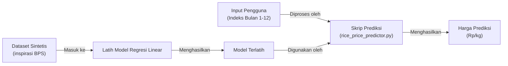

# Prediksi Harga Beras (Rice Price Predictor)

## Ikhtisar
Prediksi Harga Beras (Rice Price Predictor) adalah aplikasi *machine learning* sederhana yang dikembangkan selama program *coding-camp* ML Engineer saya. Aplikasi ini menggunakan model regresi linear untuk memprediksi harga beras (dalam Rp/kg) berdasarkan indeks waktu (misalnya, bulan). Beras adalah makanan pokok di Indonesia, dan memprediksi harganya adalah masalah yang relevan untuk memahami tren pasar. Proyek ini menunjukkan kemampuan saya dalam persiapan data, pelatihan model, dan pembuatan aplikasi ML yang ramah pengguna, selagi saya terus belajar membangun perangkat lunak yang lebih canggih.

## Cara Kerja (How It Works)

Proyek ini menggunakan *dataset* sintetis berisi data harga beras dan indeks bulan. Model regresi linear dilatih untuk memprediksi harga berdasarkan indeks bulan. Pengguna memasukkan indeks bulan (1–12), dan model menghasilkan harga prediksi. Penanganan *error* memastikan input yang valid (misalnya, angka antara 1 dan 12).

Berikut ilustrasi alur kerjanya:



## Fitur

*   Memprediksi harga beras menggunakan model regresi linear.
*   Menerima input pengguna berupa indeks bulan (1–12) melalui antarmuka baris perintah (*command-line interface*) atau Jupyter Notebook.
*   Menggunakan *dataset* sintetis yang meniru tren harga beras di Indonesia (berdasarkan data BPS).
*   Dibangun dengan Python dan scikit-learn, memastikan kesederhanaan dan kemudahan penggunaan.

## Relevansi untuk Indonesia
Beras adalah komoditas penting di Indonesia, dengan harga yang sering berfluktuasi akibat faktor-faktor seperti cuaca, hama, atau masalah pasokan. Proyek ini menunjukkan pendekatan dasar untuk memprediksi harga beras, yang dapat mendukung pengambilan keputusan bagi petani, konsumen, atau pembuat kebijakan. *Dataset* sintetis ini terinspirasi dari data nyata dari Badan Pusat Statistik (BPS) Indonesia, memastikan relevansi budaya dan ekonomi.

## Persyaratan
Untuk menjalankan proyek ini, Anda memerlukan:

*   Python 3.6+
*   scikit-learn
*   pandas
*   numpy

Instal dependensi:
```bash
pip install scikit-learn pandas numpy
```

## Instalasi

1.  Kloning repositori ini:
    ```bash
    git clone https://github.com/your-username/rice-price-predictor.git
    ```
2.  Masuk ke direktori proyek:
    ```bash
    cd rice-price-predictor
    ```
3.  Pastikan dependensi sudah terinstal (lihat Persyaratan).

## Penggunaan (Usage)

### Opsi 1: Jalankan di Jupyter Notebook

1.  Luncurkan Jupyter Notebook:
    ```bash
    jupyter notebook
    ```
2.  Buka `rice_price_predictor.ipynb` (jika sudah dikonversi ke format notebook).
3.  Jalankan semua sel.
4.  Masukkan indeks bulan (misalnya, 6) untuk mendapatkan prediksi harga beras.

### Opsi 2: Jalankan sebagai Skrip CLI (Command-Line Interface)

1.  Simpan kode sebagai `rice_price_predictor.py`.
2.  Jalankan skrip:
    ```bash
    python rice_price_predictor.py
    ```
3.  Masukkan indeks bulan (1–12) saat diminta (misalnya, 6) untuk melihat harga prediksi. Ketik `keluar` untuk keluar.

## Contoh Output (Example Output)
```
Prediksi Harga Beras (Rice Price Predictor)
Masukkan indeks bulan (1-12) atau 'keluar' untuk berhenti: 6
Prediksi harga beras untuk bulan 6: Rp 14500.00/kg
Masukkan indeks bulan (1-12) atau 'keluar' untuk berhenti: keluar
Keluar dari program...
```

## Dataset
Proyek ini menggunakan *dataset* sintetis dengan harga beras yang realistis (Rp 12.000–14.000/kg) yang terinspirasi dari data harga beras Badan Pusat Statistik (BPS) Indonesia. Untuk *dataset* yang nyata, Anda dapat mengunduh data “Rata-Rata Harga Beras di Tingkat Perdagangan Besar” (2010–2020) dari [bps.go.id](https://www.bps.go.id) atau harga terbaru dari [bi.go.id/hargapangan](https://www.bi.go.id/hargapangan). Ganti data sintetis dalam skrip dengan data BPS untuk prediksi yang lebih akurat.

## Struktur Proyek (Project Structure)

*   `script-prediksi`: Skrip Python utama dengan model regresi linear dan antarmuka CLI interaktif.
*   `README.md`: File ini, yang menjelaskan proyek.

## Konteks Pembelajaran (Learning Context)
Proyek ini dikembangkan selama program *coding-camp* ML Engineer saya untuk mempraktikkan keterampilan dasar *machine learning*, termasuk *data preprocessing*, pelatihan model, dan membangun aplikasi interaktif. Sebagai aplikasi sederhana yang disesuaikan dengan konteks Indonesia, proyek ini mencerminkan peningkatan keterampilan saya selagi saya berusaha mengembangkan perangkat lunak ML yang lebih kompleks, seperti aplikasi berbasis web atau sistem dengan *dataset* yang lebih besar.

## Peningkatan di Masa Depan (Future Improvements)

*   Menggunakan *dataset* BPS atau PIHPS yang nyata untuk prediksi yang lebih akurat.
*   Menambahkan fitur seperti wilayah, kualitas beras (misalnya, Medium I, Super I), atau data cuaca.
*   Melakukan *deploy* sebagai aplikasi web menggunakan Flask atau Streamlit untuk aksesibilitas yang lebih luas.
*   Menyertakan visualisasi, seperti plot tren harga.

## Lisensi (License)
Proyek ini dilisensikan di bawah Lisensi MIT. Lihat file `LICENSE` untuk detailnya.

## Kontak (Contact)
Jangan ragu untuk menghubungi jika ada pertanyaan atau saran:

*   GitHub: `faturrachman-dev`
*   Email: `faturrachman6773@gmail.com`